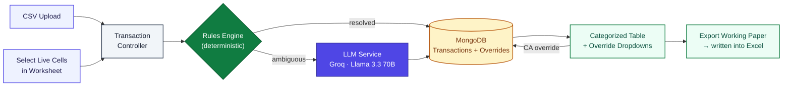
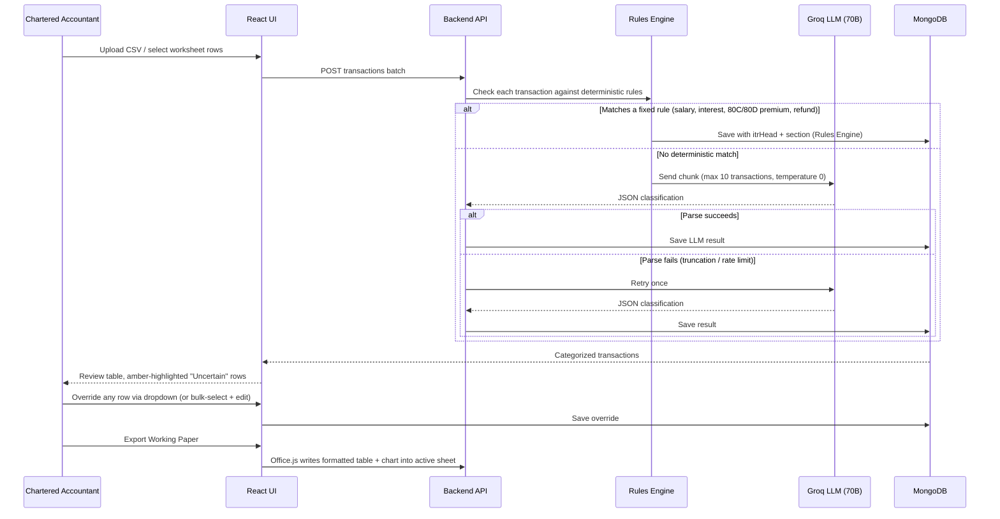

# cellTax — TaxPrep Assistant

**An Excel add-in that helps Indian Chartered Accountants map a client's bank statement directly to ITR (Income Tax Return) schedules — without leaving the spreadsheet they already work in.**

> Upload a CSV, or just select a few rows you're unsure about directly in your sheet. cellTax classifies every transaction against real ITR heads, tax treatments, and IT Act sections, flags anything genuinely ambiguous for your review, and writes a formatted working paper back into Excel.

---

## The problem

Every tax season, CAs manually eyeball hundreds of line items in a client's bank statement to figure out what's salary, what's a deductible business expense, what's a personal transfer that doesn't matter for tax purposes, and what actually needs to go on the return. It's tedious, repetitive, and easy to get wrong — but it's also not something you can safely hand to a generic AI tool and trust blindly, because a wrong tax classification isn't a UX inconvenience, it's a compliance risk.

cellTax exists to make the *first pass* fast and consistent, while keeping the CA firmly in control of every decision.

---

## Why this isn't "just call an LLM on everything"

Early on, this project genuinely did just prompt an LLM to categorize transactions — and it went badly enough that the failure modes shaped the entire final architecture. Some of what an ungoverned LLM did during testing:

- Cited **TDS sections (194J, 194I)** — which govern the *payer's* withholding obligation — as if they were the *recipient's* tax treatment section.
- Confidently labeled an ordinary **electricity bill and credit card payment as deductible business expenses**.
- Called a transaction literally described as **"Unknown Sender"** taxable business income instead of flagging it for review.
- Marked a **cash deposit to the account holder's own account** as a "deductible business expense."

None of these are exotic edge cases — they're the kind of mistake that would make a CA stop trusting the tool immediately. That's why cellTax splits work between two engines instead of routing everything through one model:

| | Rules Engine | LLM (fallback only) |
|---|---|---|
| **Handles** | Deterministic cases with a legally fixed answer (salary, FD/SB interest, Chapter VI-A premiums, capital-asset transfers, income tax refunds) | Everything else — genuinely ambiguous vendor/UPI transactions |
| **Section citations** | Hard-coded, always correct | Restricted to a fixed whitelist — never allowed to invent a section number |
| **Cost** | Free, instant | Called only when the rules engine can't resolve it |
| **On uncertainty** | N/A — these cases are unambiguous by design | Must output `Uncertain – Needs Manual Review` rather than guess |

The rule that made this actually work: **the LLM is never trusted with anything that has a legally fixed answer.** If a classification is deterministic, it's hard-coded. The LLM only ever reasons about cases that are genuinely ambiguous from the data alone — and it's required to say so when it can't tell.

---

## Architecture



## How a single transaction actually gets classified



---

## Classification taxonomy

Every transaction is written back with four fields, not a single generic "category":

| Field | Example values |
|---|---|
| `itrHead` | `Salary`, `IFOS`, `PGBP`, `Chapter VI-A Deduction`, `Not Applicable (Personal/Transfer)`, `Uncertain – Needs Manual Review` |
| `taxTreatment` | `Taxable`, `Exempt`, `Deductible`, `Non-Deductible`, `Contra` |
| `relevantSection` | e.g. `Sec 80C`, `Sec 80TTA`, `Sec 37(1)`, `Sec 10(10D)`, or `N/A` — restricted to a fixed whitelist, never freely generated |
| `reasoning` | Plain-English justification, capped at 15 words to keep output reliable at scale |

**Example:**

| Description | itrHead | taxTreatment | Section | Engine |
|---|---|---|---|---|
| NEFT-TECHCORP-SALARY SEP | Salary | Taxable | Sec 17(1) | Rules Engine |
| SAVINGS BANK INTEREST | IFOS | Taxable | Sec 80TTA | Rules Engine |
| LIC PREMIUM PAYMENT | Chapter VI-A Deduction | Deductible | Sec 80C | Rules Engine |
| AMAZON WEB SERVICES | PGBP | Deductible | Sec 37(1) | LLM |
| NEFT-UNKNOWN SENDER | Uncertain – Needs Manual Review | Uncertain | N/A | LLM |

---

## Tech stack

| Layer | Choice |
|---|---|
| Add-in frontend | React (Vite) + Office.js |
| Backend | Node.js, Express |
| Database | MongoDB (Mongoose) |
| LLM fallback | Groq API — `llama-3.3-70b-versatile` |
| Excel integration | Office.js `Excel.run` — reads live worksheet selections, writes formatted tables + native pie chart |

---

## Getting a reliable LLM fallback: what actually worked

This is the part of the build that took the most iteration, and it's worth documenting honestly rather than pretending it worked on the first try:

1. **Started with a free 8B-parameter model.** It hallucinated tax sections, confused TDS sections with the taxpayer's own treatment, and inconsistently flip-flopped between over- and under-guessing on ambiguous transactions no matter how the prompt was constrained.
2. **Tried scaling to larger free-tier models** through OpenRouter — repeatedly hit availability issues as free-tier access to larger models was pulled or rate-limited without notice.
3. **Landed on Groq's free tier running Llama 3.3 70B** — a genuinely capable model, still free, with no card required and no "your data trains our model" tradeoff.
4. **Fixed remaining reliability issues with engineering, not more prompting**: batching requests into chunks of 10 (rather than sending all transactions in one call), setting `temperature: 0` to remove sampling drift, capping the reasoning field to 15 words to avoid response truncation, and adding automatic retry-once logic for transient failures.

**Result after this process:** across all test runs, 105 transactions processed through the LLM path, 2 chunks needed a single retry (one from truncation before the token budget was increased, one from a transient rate limit), and 0 chunks failed permanently.

---

## Getting started

```bash
git clone https://github.com/HarshParyani33/cellTax.git
cd cellTax/backend
npm install
```

Create a `.env` file in `/backend`:

```
MONGODB_URI=your_mongodb_atlas_connection_string
GROQ_API_KEY=your_groq_api_key
```

```bash
npm run dev        # starts the backend
cd ../frontend
npm install
npm run dev        # starts the Office Add-in dev server
```

Sideload the add-in into Excel using the manifest in `/frontend` (Excel → Insert → My Add-ins → Upload My Add-in).

---

## Known limitations

- Column-mapping for the "process selected worksheet rows" feature relies on heuristics (date/number pattern detection) with a confirmation step — it can still misread an unusual sheet layout, which is why the CA is always shown the detected mapping before anything is sent for classification.
- No automated test suite yet — validation has been manual, run against a hand-built 46-transaction test set covering every taxonomy category.
- Not built to handle multi-currency or non-Indian tax jurisdictions.

## Roadmap

- [ ] Automated test suite covering the rules engine and taxonomy edge cases
- [ ] Configurable rule sets for jurisdictions beyond Indian ITR
- [ ] Persistent override history surfaced back to the CA as an audit trail

---

## Author

Built by **Harsh Paryani** — [GitHub](https://github.com/HarshParyani33)
